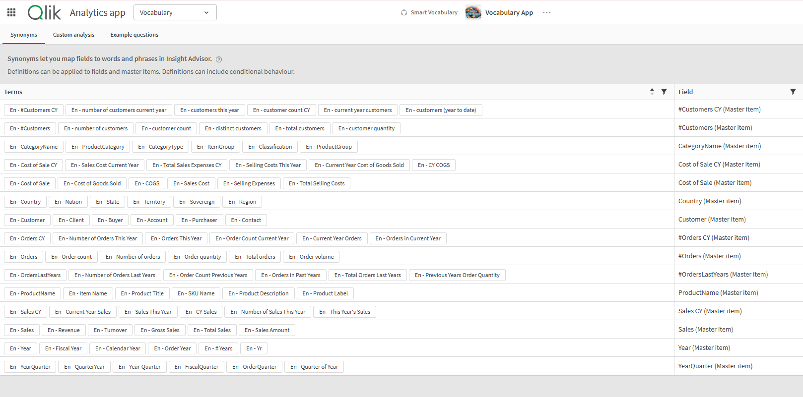

# Qlik-Smart-Vocabulary

**Qlik-Smart-Vocabulary** is a Node.js tool that connects to a Qlik app via the QIX Engine APIs, retrieves master measures and dimensions, enriches them with synonyms using OpenAI's language models, and automatically populates the app's vocabulary with the enhanced terms.

> [!NOTE]  
> This application modifies the QIX interface to update vocabulary objects within a Qlik Sense app. These objects are not officially supported by Qlik and may change without notice, potentially impacting this workflow in the future. Additionally, the app sends the titles and descriptions of Master Measures and Dimensions to an external Large Language Model (LLM). You are responsible for selecting and managing the external LLM used. Customers should carefully evaluate this approach to ensure it complies with their organization’s data governance policies. It is also strongly recommended to review the quality and accuracy of the results returned by the LLM before publishing the app for end users.

## ✨ Features

- Connects to a Qlik app using QIX Engine APIs
- Retrieves all master dimensions and measures
- Uses OpenAI's API to generate intelligent synonyms based on name and description
- Updates the app vocabulary with the generated synonyms
- Saves the updated vocabulary directly into the Qlik app

<p>
  
</p>

## 🚀 Getting Started

### Prerequisites

- Node.js v20 or later
- Access to a Qlik app (via QIX Engine API)
- Qlik Cloud API Key
- OpenAI API Key

### Installation

1. Clone the repository:

```bash
git clone https://github.com/jackBrioschi/Qlik-Smart-Vocabulary
cd Qlik-Smart-Vocabulary
```

2. Install Dependencies:
```bash
npm install
```

3. Duplicate the file .env.example and rename it .env.dev: fill the following variables of .end.dev file in the root directory

QLIK_CLOUD_APIKEY= your_qlikcloud_apikey

QLIK_CLOUD_TENANT=your-tenant-hostname.region.qlikcloud.com

QLIK_CLOUD_APPID=your_qlik_appid

OPENAI_APIKEY= your_openai_apikey

### Usage

Run the script:
```bash
node main.js
```
The script will:

1) Connect to the specified Qlik app

2) Fetch all master dimensions and measures

3) Send their names and descriptions to OpenAI for synonym enrichment: no sensitive information like values contained into each single master items are sent to OpenAI

4) Generate a vocabulary object

5) Save it back into the Qlik app


## 📄 License

This project is licensed under the MIT License.


## 🙌 Acknowledgements

- [Qlik Engine API](https://qlik.dev/apis/qix) – for enabling powerful data extraction
- [OpenAI API](https://platform.openai.com/) – for generating intelligent synonyms
